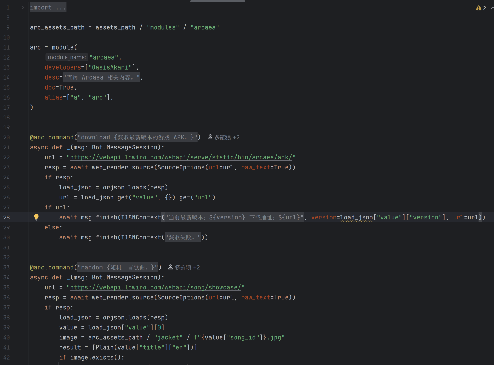
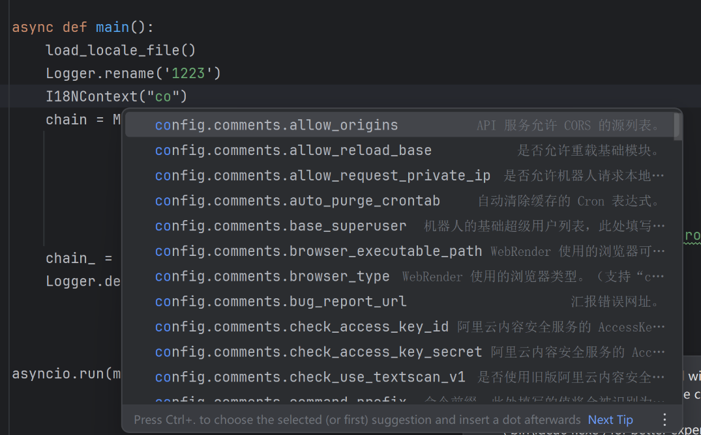

# akari-bot-dev-plugin

<!-- Plugin description -->
This plugin is designed to provide convenient functionality for developing modules for Akari Bot, and is suitable for the Pycharm platform.

本插件旨在为 Akari Bot 的模块开发提供便利功能，适用于 Pycharm 平台。
<!-- Plugin description end -->

当前实现的功能包括：

- **I18N 代码折叠** - 自动折叠 I18N 相关键名字符串，并显示对应的值名。

- **I18N 代码提示** - 在编辑 I18N 键名字符串时，提供自动补全建议。

